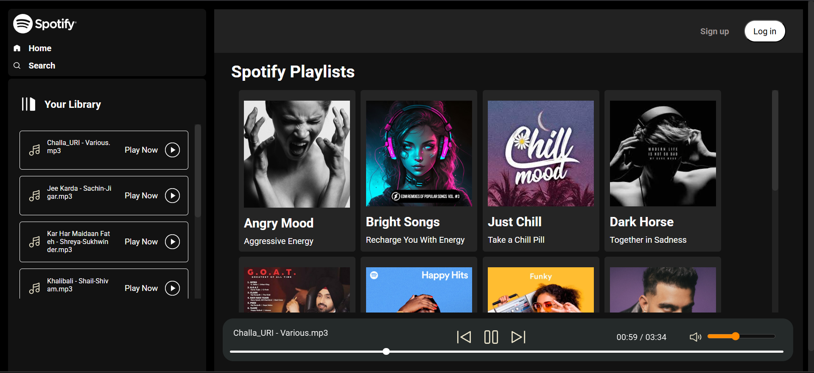
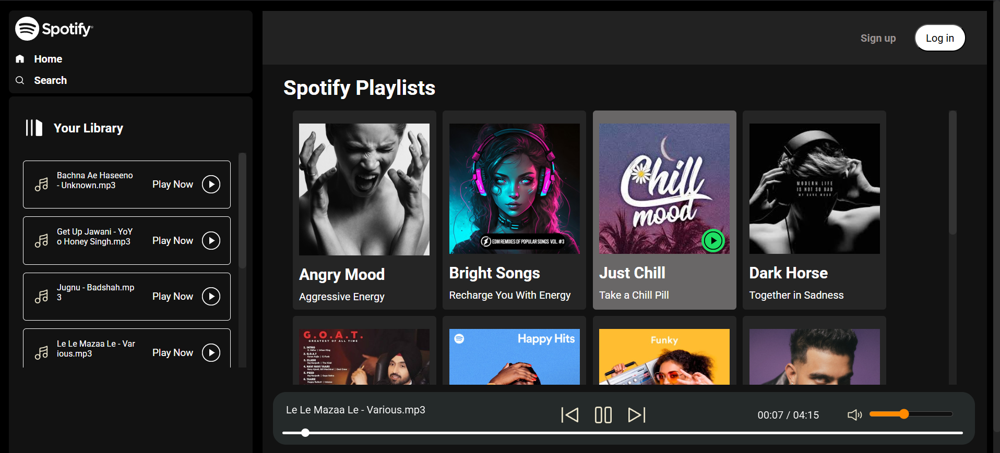
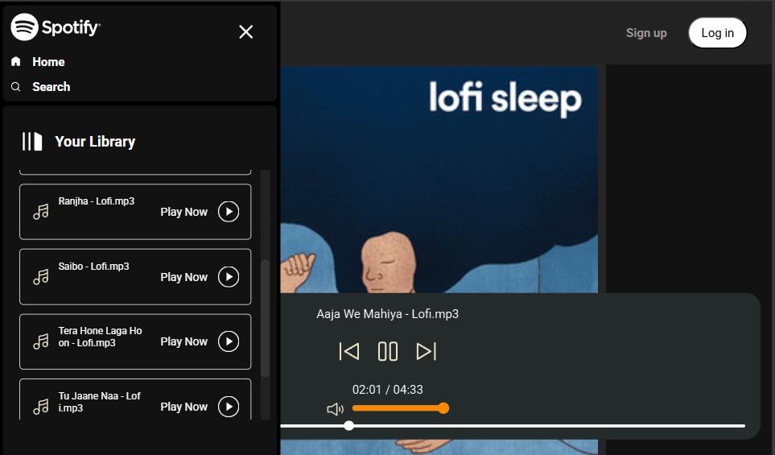
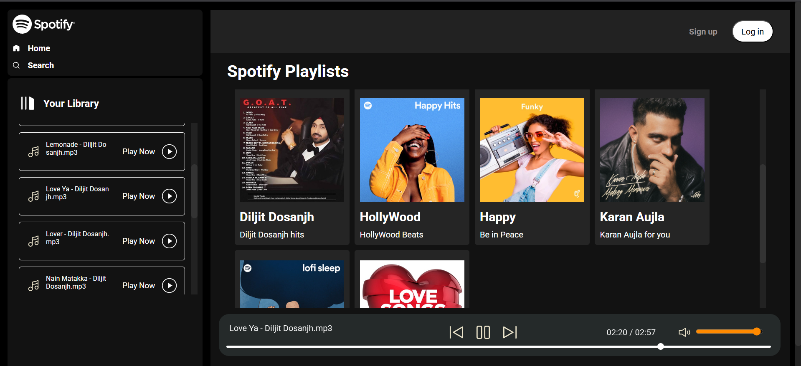
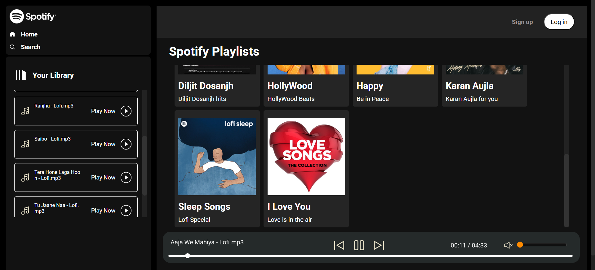

# 🎧 Spotify Web Player Clone

A fully responsive web-based music player inspired by Spotify, built using **HTML5**, **CSS3**, and **Vanilla JavaScript(ES6+)**.

This clone replicates the core UI and interactive behaviors of Spotify's player interface, including playback controls, a dynamic music library, volume control, and responsive layouts across devices.

---

## 🚀 Features

- 🎵 **Play Music:** Browse and play songs from various albums and moods.
- 📁 **Dynamic Library:** Loads albums and songs from pre-defined folders.
- 🖼️ **Album Cards:** Displays album covers, titles, and descriptions.
- ⏯️ **Playback Controls:** Play, pause, skip next, skip previous, and seek.
- 🔊 **Volume Control:** Adjustable volume with mute/unmute functionality.
- 📱 **Responsive Design:** Optimized for desktop, tablet, and mobile views.
- 🍔 **Sidebar Navigation:** Collapsible hamburger menu for small screens.
- 🎧 **Live Song Info:** Real-time display of current song name and duration.
- 🌙 **Dark Theme:** Clean, modern dark UI inspired by Spotify.

---

## 🖼️ Screenshots

> *(Make sure these files are placed in a `Screenshots/` folder in your repo)*

### 🏠 Home Page  


### 🖱️ Album Hover Effect  


### 📲 iPad View  


### 📱 iPhone 12 Pro View  


### 🔃 Scrollable Song List  


### 🔇 Volume Mute Toggle  


---

## 🎬 Demo Video

> Click below to watch the project in action:

[](Video_Demo/Demo.mp4)

➡️ [Watch Demo Video](Video_Demo/Demo.mp4)

---

## 🧪 Getting Started

### 1. Clone the Repository
git clone https://github.com/your-username/spotify-web-player-clone.git

### 2. **Open the project folder in your code editor.**
### 3. **Start a local server** (recommended).
### 4. **Enjoy the music!** (Download and add more of your favorite music in the Songs folder.)

---

## 📁 Folder Structure

spotify-web-player-clone/
```
├── index.html
├── app.js
├── CSS/
│   ├── styles.css
│   └── utility.css
├── Images/
│   └── icons, album covers, etc.
├── Songs/
│   └── music files and folders
├── Screenshots/
│   └── UI screenshots
├── Video_Demo/
│   └── Demo.mp4
```
## Credits

- UI inspired by [Spotify](https://spotify.com)
- Icons from [Spotify assets] and custom SVGs

---
**Made with ❤️ by Himanshu Gupta**
